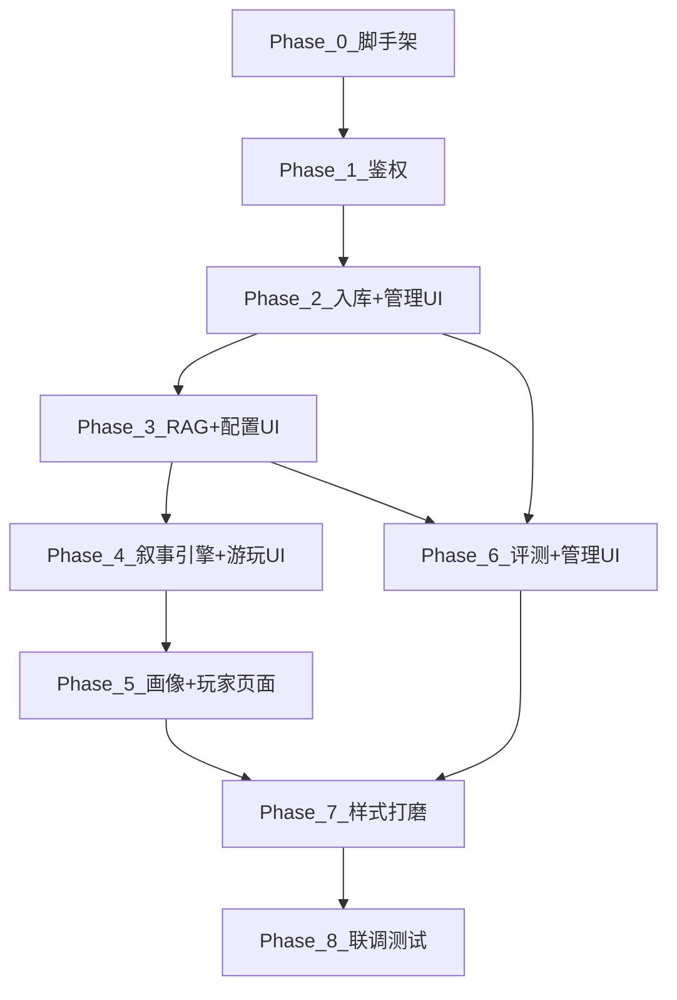

# IMPLEMENTATION_PLAN.md — 实施计划

> 版本：V1.1
> 最后更新：2026-03-19
> 总工期：约 4.5 周（32 天）
> 原则：按步构建，绝不跳步。每步完成后可独立验证。每个 Phase 包含后端 + 前端，确保即时集成验证。

---

## 阶段总览

| 阶段 | 名称 | 天数 | 核心交付物 |
|------|------|------|-----------|
| Phase 0 | 项目脚手架 | Day 1-2 | 前后端骨架可运行 |
| Phase 1 | 鉴权与用户系统 | Day 3-4 | 注册/登录/JWT 前后端跑通 |
| Phase 2 | 入库管线 + 管理内容 UI | Day 5-12 | 入库全链路 + AdminStories/Metadata 页面可用 |
| Phase 3 | RAG 检索方案 + 配置 UI | Day 13-16 | 三方案可切换 + AdminRagConfig 页面可用 |
| Phase 4 | 叙事引擎 + 游玩体验 | Day 17-24 | 游玩页全链路可用（含 SSE 流式） |
| Phase 5 | 画像系统 + 玩家页面 | Day 25-27 | 画像 + 历史/回看/画像页面可用 |
| Phase 6 | 评测系统 + 剩余管理 UI | Day 28-30 | 评测 + AdminEval/Prompts/Sessions 可用 |
| Phase 7 | 样式打磨与一致性 | Day 31 | 全页面视觉 QA 通过 |
| Phase 8 | 联调、测试与文档 | Day 32 | 端到端验证通过 |

---

## 设计原则：前端跟随后端

每个功能 Phase 分为两个子阶段：

1. **后端子阶段**：API + 服务实现，用 curl/httpie 做初步验证。
2. **前端子阶段**：对应页面 + 组件，直接对接刚完成的后端 API，发现集成问题立即修复。

公共 UI 组件（Button、Input、Table 等）**按需构建**：首次使用某组件时创建，后续 Phase 复用并迭代。不设独立的组件库构建阶段。

---

## Phase 0：项目脚手架（Day 1-2）

### 0.1 后端初始化

- [ ] 使用 `ProjectDll` 的默认虚拟环境。
- [ ] 创建 `requirements.txt`，锁定所有依赖版本（参照 TECH_STACK.md 2.x 节）。
- [ ] `pip install -r requirements.txt` 安装全部依赖。
- [ ] 创建 `app/main.py`，包含最小 FastAPI 实例 + health check 端点 `GET /api/health → {"status": "ok"}`。
- [ ] 配置 CORS 中间件：从 `settings.CORS_ORIGINS` 读取允许的源（开发环境默认 `http://localhost:5173`），挂载 `CORSMiddleware`。
- [ ] 创建 `app/core/config.py`，使用 `pydantic-settings` 从 `.env` 读取所有配置项（包括 `CORS_ORIGINS`）。
- [ ] 创建 `app/core/database.py`，配置 SQLAlchemy async engine + session factory，数据库文件指向 `data/app.db`。
- [ ] 初始化 Alembic：`alembic init alembic`，修改 `alembic.ini` 和 `env.py` 指向 async engine。
- [ ] 创建 `.env.example`，包含所有环境变量模板（参照 TECH_STACK.md 7 节）。
- [ ] 创建 `.env`，填入真实 API Key（gitignore）。
- [ ] 验证：`uvicorn app.main:app --reload`，访问 `/api/health` 返回 200。

### 0.2 前端初始化

- [ ] 在 `RAG/frontend/` 下执行 `npm create vite@latest . -- --template react-ts`。
- [ ] 安装所有依赖（参照 TECH_STACK.md 3.x 节）。
- [ ] 配置 Tailwind CSS 4。
- [ ] 创建 `src/styles/globals.css`，定义所有 CSS 变量（参照 FRONTEND_GUIDELINES.md 2 节配色方案）。
- [ ] 配置 `vite.config.ts` 开发代理：`/api` → `http://localhost:8000`。
- [ ] 创建 `src/lib/utils.ts`：`cn()` 工具函数（clsx + tailwind-merge）。
- [ ] 创建最小 `App.tsx`：显示"Hello RAG"。
- [ ] 验证：`npm run dev`，浏览器访问 `http://localhost:5173` 看到页面。

### 0.3 项目配置

- [ ] 创建 `RAG/.gitignore`：排除 `data/`、`.env`、`node_modules/`、`__pycache__/`、`*.pyc`、`.venv/`。
- [ ] 创建 `RAG/README.md`：项目简介 + 快速启动步骤（后端/前端分别启动）。
- [ ] 验证：前后端同时运行，前端可通过 `/api/health` 代理访问后端。

---

## Phase 1：鉴权与用户系统（Day 3-4）

### 1.1 数据库模型（Day 3）

- [ ] 创建 `app/models/user.py`：定义 `User` ORM 模型（参照 BACKEND_STRUCTURE.md 1.1）。
- [ ] 生成 Alembic 迁移：`alembic revision --autogenerate -m "add users table"`。
- [ ] 执行迁移：`alembic upgrade head`。
- [ ] 验证：用 SQLite 客户端确认 `users` 表结构正确。

### 1.2 鉴权服务（Day 3）

- [ ] 创建 `app/core/security.py`：JWT 生成/验证函数 + 密码哈希/校验函数。
- [ ] 创建 `app/core/dependencies.py`：`get_current_user`、`require_admin`、`require_session_owner(session_id, user)` 依赖注入函数。`require_session_owner` 供 Phase 4 会话 API 使用。
- [ ] 创建 `app/schemas/auth.py`：`RegisterRequest`、`LoginRequest`、`TokenResponse`、`UserResponse` Pydantic 模型。
- [ ] 创建 `app/services/auth.py`：`register_user`、`authenticate_user` 业务函数。
- [ ] 创建 `app/api/auth.py`：`POST /register`、`POST /login`、`POST /logout`、`GET /me` 路由。`logout` 为无状态实现（后端返回 204，前端清除 token），不做 token 黑名单。
- [ ] 在 `main.py` 注册路由 `app.include_router(auth_router, prefix="/api/auth")`。
- [ ] 手动创建一个 admin 账号的 seed 脚本 `scripts/seed_admin.py`。
- [ ] 验证：用 curl/httpie 测试注册 → 登录 → 带 token 访问 `/me`。

### 1.3 前端鉴权页面（Day 4）

- [ ] 创建首批 UI 基础组件：`Button.tsx`、`Input.tsx`（后续 Phase 复用）。
- [ ] 创建 `src/api/client.ts`：axios 实例，自动带 Authorization header。
- [ ] 创建 `src/stores/authStore.ts`：zustand store 管理 token + user 信息。
- [ ] 创建 `src/pages/LoginPage.tsx`：登录表单 + 错误提示。
- [ ] 创建 `src/pages/RegisterPage.tsx`：注册表单 + 错误提示。
- [ ] 创建 `src/components/layout/AuthGuard.tsx`：未登录重定向到 `/login`。
- [ ] 创建 `src/components/layout/TopNav.tsx`：顶部导航栏骨架（登录/未登录两态）。
- [ ] 配置 `react-router-dom` 路由：`/login`、`/register`、`/`（受保护）。
- [ ] 验证：浏览器中注册 → 登录 → 看到受保护首页 → 退出 → 重定向。

### 1.4 用户设置（Day 4）

- [ ] 创建 `app/api/users.py`：`PUT /api/users/me/settings` 路由。
- [ ] 创建 `src/pages/SettingsPage.tsx`：修改昵称/简介的表单。
- [ ] 验证：修改昵称后刷新页面，导航栏显示新昵称。

---

## Phase 2：入库管线 + 管理内容 UI（Day 5-12）

> 后端 Day 5-10 | 前端 Day 11-12

### ── 后端 ──

### 2.1 作品数据模型（Day 5）

- [ ] 创建所有作品相关 ORM 模型：`Story`、`StoryVersion`、`Chapter`、`Scene`、`TextChunk`、`Entity`、`Relationship`、`TimelineEvent`、`RiskSegment`、`IngestionJob`、`IngestionWarning`。
- [ ] 创建用户画像 ORM 模型：`UserProfile`（全局画像，FK → users）、`StoryProfile`（作品级画像覆写，FK → users + stories）。虽然画像服务在 Phase 5 实现，但 Phase 4.8 的上下文拼装需要读取这两张表，须在此处先建好。
- [ ] 生成并执行 Alembic 迁移。
- [ ] 验证：SQLite 中所有表结构正确（包括 user_profiles、story_profiles）。

### 2.2 文件上传接口（Day 5）

- [ ] 创建 `app/api/admin/stories.py`：`POST /api/admin/stories/upload`（接收文件 + 标题 + 简介）。
- [ ] 实现文件保存到 `data/uploads/{story_id}/{filename}`。
- [ ] 创建 Story 和初始 StoryVersion 记录。
- [ ] 验证：上传一个 TXT 文件，确认文件存储 + 数据库记录正确。

### 2.3 文档解析器（Day 6）

- [ ] 创建 `app/services/ingestion/parser.py`：
  - `parse_txt(filepath) → str`（同时处理 `.md` 文件，两者均为纯文本读取）
  - `parse_pdf(filepath) → str`
  - `parse_docx(filepath) → str`
  - `parse_json(filepath) → dict`
- [ ] 每个解析器做 best-effort 处理，失败时返回部分结果 + warning 列表。
- [ ] 编写单元测试：至少用一个 TXT 样例验证解析正确。

### 2.4 章节/场景切分器（Day 6-7）

- [ ] 创建 `app/services/ingestion/chunker.py`：
  - `detect_chapters(text) → chapters[]`：基于正则 + 启发式识别章节边界。
  - `detect_scenes(chapter_text) → scenes[]`：基于空行/分隔符识别场景。
  - `chunk_text(text, max_tokens, overlap) → chunks[]`：在场景/段落粒度切块。
- [ ] 章节切分支持中文常见格式：「第X章」「第X回」「Chapter X」等。
- [ ] 编写单元测试。

### 2.5 实体/关系/时间线抽取（Day 7-8）

- [ ] 创建 `app/services/ingestion/extractor.py`：
  - `extract_entities(chapter_text) → entities[]`：调用 DeepSeek 提取实体。
  - `extract_relationships(entities, chapter_text) → relationships[]`：调用 DeepSeek 提取关系。
  - `extract_timeline(chapter_text) → events[]`：调用 DeepSeek 提取时间线。
  - `merge_entities(all_entities) → merged[]`：跨章节归并别名。
- [ ] 为每个抽取函数设计专用提示词模板（输出要求 JSON 格式）。
- [ ] 验证：对一个章节样本运行抽取，检查输出合理性。

### 2.6 摘要生成（Day 8）

- [ ] 创建 `app/services/ingestion/summarizer.py`：
  - `summarize_chapter(chapter_text) → str`
  - `summarize_scene(scene_text) → str`
- [ ] 调用 DeepSeek 生成摘要，控制长度在 200 字以内。
- [ ] 验证：对样本章节生成摘要，检查质量。

### 2.7 敏感内容处理（Day 9）

- [ ] 创建 `app/services/ingestion/safety.py`：
  - `detect_risk_segments(text) → risk_segments[]`：调用 DeepSeek 识别高风险段落。
  - `rewrite_segment(original) → rewritten`：调用 DeepSeek 做文艺化改写。
- [ ] 验证：对含敏感内容的样本运行，检查改写质量。

### 2.8 向量化索引（Day 9）

- [ ] 创建 `app/services/ingestion/indexer.py`：
  - 初始化 ChromaDB 客户端（持久化到 `data/chroma/`）。
  - `embed_and_store(chunks, story_version_id)`：调用 SiliconFlow Embedding API，存入 Chroma。
  - 每个 chunk 的 metadata 包含 `story_version_id`、`chapter_id`、`scene_id`。
- [ ] 验证：索引一批 chunks 后，用相似查询测试能召回相关内容。

### 2.9 入库管线编排（Day 10）

- [ ] 创建 `app/services/ingestion/pipeline.py`：
  - `run_ingestion(story_id)` 按顺序执行 2.3-2.8 的全部步骤。
  - **版本策略**：入库前若已有 StoryVersion，创建新版本，将上一版标记为 `backup`（保留最新版 + 一份备份，更早的版本标记为 `archived`）。旧会话继续绑定原版本，新会话自动使用最新版。
  - 每步完成后更新 `IngestionJob` 进度。
  - 失败步骤记录到 `IngestionWarning`，管线继续。
- [ ] 创建 `POST /api/admin/stories/{id}/ingest` 路由触发入库。
- [ ] 创建 `GET /api/admin/stories/{id}/ingestion-jobs` 查看入库状态。
- [ ] 验证：上传一部完整 TXT 小说 → 触发入库 → 全部步骤完成 → 数据库和 Chroma 中有数据。

### 2.10 作品管理补全 API（Day 10）

- [ ] 在 `app/api/admin/stories.py` 中补齐以下路由（参见 `BACKEND_STRUCTURE.md` §2.5）：
  - `GET /api/admin/stories`：所有作品列表（含状态、版本数、最后入库时间）。
  - `PUT /api/admin/stories/{id}`：更新作品基础信息（标题、简介、封面）。
  - `DELETE /api/admin/stories/{id}`：软删除作品及全部关联数据（包括 Chroma 中的向量）。
  - `POST /api/admin/stories/{id}/rollback`：回滚到指定 StoryVersion。
- [ ] 验证：列出 → 编辑 → 删除 → 回滚 流程端到端通过。

### 2.11 元数据编辑 API（Day 10）

- [ ] 创建 `app/api/admin/metadata.py`，实现统一 CRUD 路由（参见 `BACKEND_STRUCTURE.md` §2.6）：
  - 实体 (entities): GET / POST / PUT / DELETE
  - 关系 (relationships): GET / POST / PUT / DELETE
  - 时间线 (timeline): GET / POST / PUT / DELETE
  - 章节 (chapters): GET / PUT
  - 场景 (scenes): PUT
  - 敏感段落 (risk-segments): GET / PUT
- [ ] 所有端点需校验 `story_id` 存在且处于非入库中状态。
- [ ] 元数据变更后需同步更新 Chroma 中的相关向量 metadata（标记 dirty，下次入库时自动重建）。
- [ ] 验证：对已入库作品的实体做增删改查，确认数据库和检索结果同步。

### 2.12 玩家端故事 API（Day 10）

- [ ] 创建 `app/api/stories.py`（参见 `BACKEND_STRUCTURE.md` §2.3）：
  - `GET /api/stories`：列出所有 `status=ready` 的作品（标题、简介、封面、标签）。
  - `GET /api/stories/{id}`：作品详情（含章节目录，不含管理字段）。
- [ ] 需 Bearer 鉴权（任意已登录用户可访问），不需要 admin 权限。
- [ ] 验证：以 player 身份调用 API，确认仅返回已就绪作品。

### ── 前端 ──

### 2.13 公共基础组件 + 管理后台布局（Day 11）

- [ ] 创建基础 UI 组件（首次使用，后续复用）：`Table`、`Tabs`、`Badge`、`Dialog`、`Toast`、`Dropdown`。所有组件遵循 FRONTEND_GUIDELINES.md 配色/间距/圆角规范。
- [ ] 创建布局组件：`AdminSidebar`、`AdminGuard`（仅 admin 角色可访问，否则重定向首页）。
- [ ] 配置 `react-router-dom` admin 路由组：`/admin/*` 嵌套在 `AdminGuard` 内。
- [ ] 创建 `src/hooks/useAdminApi.ts`：封装 admin 端点的 React Query hooks。
- [ ] 验证：以 admin 登录 → 访问 `/admin` → 看到侧边栏布局；以 player 登录 → 访问 `/admin` → 重定向到首页。

### 2.14 AdminStoriesPage（Day 11-12）

- [ ] `AdminStoriesPage.tsx`：作品列表 + 上传 + 删除 + 重建入库。
  - 文件上传组件（拖拽/点击选择，显示文件名和大小）。
  - 入库状态轮询显示（进行中/成功/部分失败 + IngestionWarning 列表）。
  - 版本回滚操作（确认弹窗）。
- [ ] 验证：通过 UI 上传一部 TXT 小说 → 触发入库 → 看到入库状态变为完成。

### 2.15 AdminMetadataPage（Day 12）

- [ ] `AdminMetadataPage.tsx`：Tab 切换（实体/关系/时间线/章节/场景/敏感段落）+ 表格 CRUD。
  - 每个 Tab 一个 Table，支持行内编辑/新增/删除。
  - 敏感段落 Tab 显示原文 vs 改写文本对照。
- [ ] **（2026-03 增补）** 场景 Tab：`GET/PUT/DELETE /api/admin/stories/{id}/metadata/scenes/{scene_id}`；可编辑 **正文 raw_text**（触发切块重建与 Chroma 更新）与摘要，支持删除场景并重排 `scene_number`。
- [ ] 验证：选中已入库作品 → 查看实体列表 → 编辑一个实体名 → 保存成功 → 刷新确认持久化。

---

## Phase 3：RAG 检索方案 + 配置 UI（Day 13-16）

> 后端 Day 13-15 | 前端 Day 16

### ── 后端 ──

### 3.1 RAG 配置模型（Day 13）

- [x] 创建 `RagConfig` ORM 模型 + Alembic 迁移。
- [x] 创建 seed 脚本，预置三种方案的默认配置：
  ```
  A: {variant_type: "naive_hybrid", config: {bm25_top_k: 10, vector_top_k: 10, bm25_weight: 0.3, final_top_k: 5}}
  B: {variant_type: "parent_child", config: {child_top_k: 5, parent_expand: 2}}
  C: {variant_type: "structured", config: {text_top_k: 3, event_top_k: 5}}
  ```
- [x] 创建管理员 RAG 配置 API（GET / PUT / activate）。
- [ ] 验证：API 可列出三方案，可激活切换。

### 3.2 方案 A — 朴素混合 RAG（Day 13-14）

- [x] 创建 `app/services/rag/base.py`：定义 `BaseRetriever` 抽象基类。
- [x] 创建 BM25 索引工具：对 story_version 的所有 chunks 建 BM25 索引（内存缓存）。
- [x] 创建 `app/services/rag/variant_a.py`：
  - BM25 搜索 + Chroma 向量搜索 + Reciprocal Rank Fusion 合并。
- [x] 编写集成测试：给定查询，验证返回结果包含相关内容。（单元测试：加权 RRF、上下文预算）

### 3.3 方案 B — 父子块分层检索（Day 14）

- [x] 创建 `app/services/rag/variant_b.py`：
  - Chroma 搜索命中子块（场景/段落粒度）。
  - 根据子块的 scene_id / chapter_id 向上查找父块。
  - 拉取父块摘要 + 子块原文组合。
- [x] 编写集成测试。（与 A 共用 dispatcher/上下文测试；全链路需 Chroma+DB 环境）

### 3.4 方案 C — 结构化辅助检索（Day 14-15）

- [x] 创建 `app/services/rag/variant_c.py`：
  - 调用 DeepSeek 从用户查询中识别实体名。
  - 从 `entities`、`relationships`、`timeline_events` 表查询匹配实体的结构化数据。
  - Chroma 向量搜索补充文本切块。
  - 组合结构化事实 + 文本切块。
- [x] 编写集成测试。（调度器错误路径单测；端到端需 DeepSeek）

### 3.5 检索调度器（Day 15）

- [x] 创建 `app/services/rag/dispatcher.py`：
  - `retrieve(query, session) → context`：根据 session 绑定的 rag_config 分发到对应方案。
- [x] 创建 `app/services/rag/context.py`：
  - `assemble_context(retrieved, session_state, profile, mode, token_budget) → prompt_parts`。
  - 实现按模式动态调整优先级的压缩逻辑。
- [ ] 验证：三方案各自返回不同形式的检索结果，上下文拼装不超过 Token 预算。

### ── 前端 ──

### 3.6 AdminRagConfigPage（Day 16）

- [x] `AdminRagConfigPage.tsx`：三方案卡片（朴素混合 RAG / 父子块分层 / 结构化辅助）+ 激活切换 + 参数编辑。
  - 当前激活方案高亮卡片边框。
  - 参数以 JSON 表单展示，可编辑并保存。
  - 激活操作需确认弹窗。
- [x] 验证：激活方案 B → 刷新页面 → 方案 B 仍为激活态 → 修改参数 → 保存成功。（`npm run build` 通过；端到端请在本地联调确认）

---

## Phase 4：叙事引擎 + 游玩体验（Day 17-24）

> 后端 Day 17-21 | 前端 Day 22-24

### ── 后端 ──

### 4.1 会话数据模型（Day 17）

- [x] 创建所有会话相关 ORM 模型：`Session`、`SessionState`、`SessionEvent`、`SessionMessage`、`UserFeedback`。
- [x] 创建 `PromptTemplate` ORM 模型。
- [x] 生成并执行 Alembic 迁移。（迁移文件 `d4e5f6a7b8c9`，`down_revision=b7c4e2d1a9f0`；若本地 `alembic_version` 与仓库链不一致需先 `stamp`/`修复` 后再 `upgrade head`）
- [x] 创建提示词 seed 脚本：预置四层提示词模板（system / retrieval / gm / style）× 两种模式。
- [ ] 验证：迁移执行成功，SQLite 中可见 sessions、session_states、prompt_templates 等表。

### 4.2 会话管理 API（Day 17-18）

- [x] 创建 `app/api/sessions.py`：
  - `POST /api/sessions`：创建会话，绑定 story_version + rag_config + mode。
  - `GET /api/sessions`：列出我的会话。
  - `GET /api/sessions/{id}`：会话详情。
  - `DELETE /api/sessions/{id}`：硬删除。
  - `POST /api/sessions/{id}/archive`：归档。
  - `GET /api/sessions/{id}/messages`：消息列表。
  - `GET /api/sessions/{id}/state`：当前状态。
  - `POST /api/sessions/{id}/feedback`：提交反馈。
- [ ] 验证：创建会话 → 查看 → 归档 → 删除。（`POST .../messages` 流式见 Phase 4.4）

### 4.3 提示词系统（Day 18）

- [x] 创建 `app/services/narrative/prompts.py`：
  - `build_system_prompt(mode, style_config) → str`：拼装系统 + GM + 风格层。
  - `build_retrieval_prompt(context) → str`：拼装检索证据。
  - `build_generation_prompt(user_input, context, state, profile) → messages[]`：组装最终的消息列表。
  - 提示词需包含**叙事角色切换**指令：默认以 GM 裁定者身份叙事；当场景聚焦于与某个 NPC 互动时（由 `state_update.npc_relations` 判断），切换为该角色口吻对话（参见 PRD F04）。`npc_relations` 字段的 schema 在 4.4 状态管理中定义，此处先在提示词中预设格式约定。
- [x] 确保输出指令要求模型使用 `\n---META---\n` 分隔符协议（参见 `BACKEND_STRUCTURE.md` §4.4.1），先输出纯叙事文本，分隔符后输出 JSON 元数据。
- [x] 验证：调用 `build_generation_prompt` 返回符合预期结构的 messages 列表，其中 system prompt 包含分隔符格式要求和角色切换指令。（`tests/test_narrative_prompts.py`）

### 4.3b 管理员提示词 API（Day 18）

- [x] 创建 `app/api/admin/prompts.py`（参见 `BACKEND_STRUCTURE.md` §2.7）：
  - `GET /api/admin/prompts`：列出所有提示词模板（按 layer × mode 分组）。
  - `PUT /api/admin/prompts/{id}`：更新提示词内容。
  - `POST /api/admin/prompts`：新增提示词模板。
- [ ] 验证：列出 → 编辑 → 新增流程可用。

### 4.3c 管理员会话查看 API（Day 18）

- [x] 创建 `app/api/admin/sessions.py`（参见 `BACKEND_STRUCTURE.md` §2.10）：
  - `GET /api/admin/sessions`：所有用户会话列表（支持按 story、user、status 筛选）。
  - `GET /api/admin/sessions/{id}/transcript`：完整对话记录。
  - `GET /api/admin/sessions/{id}/feedback`：用户反馈列表。
- [ ] 验证：列出所有会话 → 查看某会话完整对话 → 查看反馈。

### 4.4 状态管理（Day 19）

- [x] 创建 `app/services/narrative/state.py`：
  - `initialize_state(session) → state_dict`：创建初始状态 {current_location, active_goal, important_items, npc_relations}。
  - `validate_state_update(current_state, proposed_update) → validated_update`：软校验。
  - `apply_state_update(session_id, turn, update)`：写入 DB。
- [x] 验证：创建初始状态 → 模拟状态更新 → 验证数据库写入。（`tests/test_narrative_state.py`）

### 4.5 叙事生成核心（Day 19-20）

- [x] 创建 `app/services/narrative/engine.py`：
  - `generate_opening`：非流式开场 + 落库；玩家 `POST /api/sessions/{id}/opening`。
  - `process_turn_sse`：`POST /api/sessions/{id}/messages` 流式 SSE（`data: {json}\\n\\n`），等价规划中的 `process_turn → AsyncIterator[SSEEvent]`：
    1. 加载会话状态与历史。
    2. 调用 RAG 检索。
    3. 拼装上下文（`assemble_context` 注入 `user_profiles` / `story_profiles`，见 4.8）。
    4. 调用 DeepSeek `stream=True`。
    5. **分隔符流式协议解析**（详见 `BACKEND_STRUCTURE.md` §4.4）：
       - 逐 token 检测 `---META---` 分隔符。
       - 分隔符前的 token 即时 Yield `SSEEvent(type=token)`。
       - 分隔符后的 token 缓冲至流结束，解析 JSON 得到 `choices`、`state_update`、`internal_notes`。
    6. 校验 `state_update`（软约束），写入 `session_states`。
    7. 写入 `session_messages`（叙事文本）+ `session_events`。
    8. 记录 `internal_notes` 到日志。
    9. Yield `SSEEvent(type=choices)` → `SSEEvent(type=state_update)` → `SSEEvent(type=done)`。
  - **异常路径**：JSON 解析失败或未检测到分隔符时，`choices` 和 `state_update` 置空，发送 `type=error` 提示，记录错误日志。
- [ ] 验证：调用 `generate_opening` / 流式 `messages` 在真实 DeepSeek 下端到端成功。（单测：`tests/test_meta_parse.py`）
- [x] 补充：`deepseek_chat_stream`、`meta_parse.py`（`MetaStreamSplitter` / `parse_complete_model_output`）。

### 4.6 内容安全层（Day 20）

- [x] 创建 `app/services/narrative/safety.py`：
  - `soften_content(text) → str`：调用 DeepSeek 对高风险输出做文艺化改写。
  - `handle_api_block(session_id, user_input) → FallbackNarrative`：风控拦截时的退化处理（结构化 narrative / choices / log_message）。
  - `is_likely_content_policy_block(exc)`：根据 `RuntimeError` / `APIStatusError` 文案与状态码粗判内容策略拦截。
- [x] 在 `generate_opening` / `process_turn_sse` 中集成安全层：
  - 开场：`deepseek_chat` 拦截 → 落库 `handle_api_block` 文案；可选 `NARRATIVE_SAFETY_SOFTEN=true` 时对开场叙事再调用 `soften_content`（**流式回合暂不软化**，避免与已推送 `token` 不一致）。
  - 流式：`deepseek_chat_stream` 拦截 → `rollback` 本轮（含 user 消息）+ SSE `error` + `done`，不落库 fallback。
- [x] 验证：`tests/test_safety.py`（mock `soften_content` / 流式拦截 + rollback）；高风险样本集成测需真实 API，见脚本验收。

### 4.7 流式 API（Day 20-21）

- [x] 创建 `POST /api/sessions/{id}/messages` 的 SSE 流式实现（已落地）：
  - 路由：[`app/api/sessions.py`](RAG/backend/app/api/sessions.py) `stream_session_message` → `StreamingResponse(media_type="text/event-stream; charset=utf-8")`。
  - 生成：[`app/services/narrative/engine.py`](RAG/backend/app/services/narrative/engine.py) `process_turn_sse`，事件类型 `token`、`choices`、`state_update`、`error`、`done`。
  - 前端须使用 `fetch` + `ReadableStream` 手动解析（不可用 `EventSource`，因为是 POST + Bearer 鉴权）。→ 见 Phase 4.11。
- [x] 验证：见 [`scripts/verify_phase4_backend.py`](RAG/backend/scripts/verify_phase4_backend.py)（`SKIP_LLM` 未设时跑 SSE）；文档字符串内附 **curl** 示例；单测 `tests/test_safety.py::test_process_turn_sse_content_policy_rollback` 覆盖错误路径序列。

### 4.8 画像检索集成（Day 21）

- [x] 在 `context.py` 中集成用户画像层：
  - 加载：[`app/services/profile_loader.py`](RAG/backend/app/services/profile_loader.py) `load_session_profile_bundle`（`user_profiles` + `story_profiles`）。
  - 拼入：[`app/services/rag/context.py`](RAG/backend/app/services/rag/context.py) `assemble_context` 前置 `[用户画像-全局]` / `[用户画像-本作品覆写]`，预算不足时先丢检索尾部。
  - `build_generation_prompt`：画像默认仅经检索块注入；仅当显式传入非空 `profile` 时保留 tail「用户画像/作品覆写 JSON」（兼容旧调用）。
- [x] 验证：`tests/test_context_profile.py`；`session_messages.metadata` 增加 `profile_context_used`；多轮 curl / `verify_phase4_backend` 需在 DB 中有画像数据时人工确认。

### ── 前端 ──

### 4.9 故事库 + 新会话页面（Day 22）

- [ ] `StoryCard.tsx`：故事卡片（封面占位、标题、简介截断、入库状态标签）。参照 FRONTEND_GUIDELINES.md §6.7。
- [ ] `StoryLibraryPage.tsx`：作品卡片网格列表，调用 `GET /api/stories`。
- [ ] `NewSessionPage.tsx`：模式选择（严谨/创作单选）+ 冒险目标输入 + 「开始冒险」按钮。调用 `POST /api/sessions`。
- [ ] 创建 `Textarea.tsx` 基础组件（首次使用）。
- [ ] 验证：浏览故事库 → 选择作品 → 配置新会话 → 点击开始 → 跳转到游玩页。

### 4.10 游玩页核心组件（Day 22-23）

- [ ] `PlaySessionPage.tsx`：核心游玩界面布局（参照 FRONTEND_GUIDELINES.md §7.2）。
- [ ] `ChatBubble.tsx`：GM 气泡（左对齐，金色色条）+ 玩家气泡（右对齐）。
- [ ] `ChoicePanel.tsx`：选项按钮组（2-4 个按钮 + 自由输入切换）。
- [ ] `StatePanel.tsx`：可折叠状态面板（ChevronLeft 旋转动画，参照 FRONTEND_GUIDELINES.md §6.8）。
- [ ] `MessageInput.tsx`：输入框 + 发送按钮（流式输出期间禁用）。
- [ ] `FeedbackDialog.tsx`：反馈弹窗（评分 + 文字反馈）。
- [ ] 验证：PlaySessionPage 能渲染所有子组件，布局符合 FRONTEND_GUIDELINES.md §7.2。

### 4.11 SSE 流式集成（Day 23-24）

- [ ] 创建 `src/hooks/useSSEStream.ts`：`fetch` + `ReadableStream` 手动解析 SSE 事件行。**不可用 `EventSource`**（后端是 POST + Bearer 鉴权）。
  - 解析 `type=token` → 逐字追加到当前 GM 气泡。
  - 解析 `type=choices` → 渲染选项按钮组。
  - 解析 `type=state_update` → 刷新状态面板（高亮动画）。
  - 解析 `type=error` → Toast 错误提示。
  - 解析 `type=done` → 恢复输入框可用。
- [ ] 创建 `src/stores/sessionStore.ts`：Zustand store 管理当前会话消息列表 + 状态面板数据 + 流式状态标志。
- [ ] 集成 FeedbackDialog：对任意 GM 消息点击反馈图标 → 弹窗 → 提交 → Toast 成功。
- [ ] 验证：**完整游玩 3+ 轮**，确认流式逐字输出 → 选项渲染 → 点击选项 → 下一轮生成 → 状态面板实时刷新 → 反馈提交。此为全项目最关键的集成验证点。

---

## Phase 5：画像系统 + 玩家页面（Day 25-27）

> 后端 Day 25-26 | 前端 Day 27

### ── 后端 ──

### 5.1 画像推断服务（Day 25）

- [ ] 创建 `app/services/profile.py`：
  - `infer_preferences(session_messages, current_profile) → profile_updates`：调用 DeepSeek 分析近几轮对话推断偏好变化。
  - `classify_update_target(update) → "global" | "story"`：判断是全局偏好还是作品内偏好。
  - `apply_profile_update(user_id, story_id, updates)`：写入对应的 profile 表。

### 5.2 自动更新触发（Day 25）

- [ ] 在 `process_turn` 结束后异步触发画像更新（每 3-5 轮触发一次，不每轮都触发以控制成本）。

### 5.3 角色卡导入（Day 26）

- [ ] 创建 `POST /api/users/me/profile/import` 接口：接收 JSON 文件，解析后写入 `user_profiles` 或 `story_profiles`。
- [ ] 定义角色卡 JSON Schema。

### 5.4 画像 API（Day 26）

- [ ] 创建 `GET /api/users/me/profile`、`GET /api/users/me/profile/story/{id}` 接口。
- [ ] 验证：游玩几轮后，画像数据有更新；API 返回最新画像。

### ── 前端 ──

### 5.5 玩家历史与画像页面（Day 27）

- [ ] `SessionHistoryPage.tsx`：会话列表（作品名、模式、目标、轮数、状态、创建时间）。支持按状态筛选（进行中/已归档）。
- [ ] `SessionReplayPage.tsx`：只读回看（消息列表 + 每轮状态快照，不可输入）。
- [ ] `ProfilePage.tsx`：画像查看（全局标签 + 作品级标签，只读展示）。角色卡导入按钮（JSON 文件上传）。
- [ ] 验证：游玩几轮 → 返回历史列表看到会话 → 点击回看 → 返回画像页看到标签。

---

## Phase 6：评测系统 + 剩余管理 UI（Day 28-30）

> 后端 Day 28-29 | 前端 Day 30

### ── 后端 ──

### 6.1 评测数据模型（Day 28）

- [ ] 创建 `EvalRun`、`EvalCase`、`EvalResult` ORM 模型 + 迁移。

### 6.2 测试用例生成（Day 28）

- [ ] 创建 `app/services/eval.py`：
  - `generate_eval_cases(story_version_id) → cases[]`：调用 DeepSeek 根据作品内容自动生成测试题（事实问答、时间线、续写一致性、GM 裁定、个性化）。
  - 每题包含 question + case_type + evidence_spans + rubric。

### 6.3 评测执行（Day 28-29）

- [ ] `run_evaluation(rag_config_id, story_version_id, cases)`：
  - 对每道测试题执行：检索 → 生成 → 调用 LLM 评委打分。
  - 评委提示词包含：rubric + evidence_spans + 生成的回答。
  - 写入 `EvalResult`。
  - 计算汇总分数写入 `EvalRun`。

### 6.4 会话样本评测（Day 29）

- [ ] `sample_session_eval(session_id)`：
  - 从真实会话中抽取关键轮次。
  - 对每轮生成内容进行忠实性 + 叙事质量评分。

### 6.5 评测 API（Day 29）

- [ ] 创建 `app/api/admin/eval.py`，管理员评测路由（参见 `BACKEND_STRUCTURE.md` §2.9）：
  - `POST /api/admin/eval/runs`：发起新评测。
  - `GET /api/admin/eval/runs`：列出评测运行。
  - `GET /api/admin/eval/runs/{id}`：评测运行详情。
  - `GET /api/admin/eval/runs/{id}/results`：评测结果列表。
  - `POST /api/admin/eval/sample-sessions`：抽取会话样本评测。
- [ ] 验证：发起一次评测 → 运行完成 → 查看分数与详情。

### ── 前端 ──

### 6.6 管理后台剩余页面（Day 30）

- [ ] `AdminEvalPage.tsx`：发起评测 + 结果列表 + 方案对比（表格 + 数据对比视图）+ 单题详情展开。
- [ ] `AdminPromptsPage.tsx`：分层提示词编辑器（按 layer × mode 分组展示，点击展开编辑区，保存后刷新）。
- [ ] `AdminSessionsPage.tsx`：所有用户会话列表（支持搜索/筛选）+ 完整对话记录查看 + 反馈列表。
- [ ] 验证：发起评测 → 查看结果 → 编辑一条提示词 → 查看某用户会话完整对话。

---

## Phase 7：样式打磨与一致性（Day 31）

- [ ] **全页面视觉 QA**：逐页对照 FRONTEND_GUIDELINES.md 检查配色/间距/字体/圆角/动画。
- [ ] **组件一致性审计**：Phase 2-6 中按需创建的组件 API 统一（props 命名、变体写法）、样式无偏差。
- [ ] **TopNav 完善**：登录/未登录态完整切换、admin 下拉菜单项（仅桌面端，最小视口 1024px，不做移动端适配）。
- [ ] **空状态/加载态/错误态补全**：所有列表页的 Loading Skeleton、空数据提示、请求失败 fallback。
- [ ] **微交互补全**：按钮 hover/active 反馈、状态面板箭头旋转、Toast 进场/退场、卡片 hover 效果。
- [ ] 验证：全页面截图对照 FRONTEND_GUIDELINES.md 无明显偏差。

---

## Phase 8：联调、测试与文档（Day 32）

### 8.1 端到端验证

- [ ] 管理员流程：注册 admin → 上传小说 → 触发入库 → 入库完成 → 编辑实体/关系 → 配置提示词 → 激活方案 A。
- [ ] 玩家流程：注册 player → 登录 → 浏览故事库 → 选择作品 → 设定严谨模式 + 目标 → 游玩 5 轮以上 → 标记一条反馈 → 归档会话 → 查看历史 → 查看画像。
- [ ] 方案切换流程：管理员切换到方案 B → 玩家开新会话 → 体感对比。再切方案 C 重复。
- [ ] 评测流程：管理员发起评测 → 三方案各跑一轮 → 评测面板对比分数。
- [ ] **多账号隔离验证**：创建 2 个 player 账号，分别游玩同一作品并提交反馈，确认会话、画像、反馈互不可见（验证 PRD S03）。

### 8.2 回归测试

- [ ] 运行后端 pytest 全部通过。
- [ ] 运行前端 vitest 全部通过。
- [ ] 检查所有 API 的 401/403/404 错误响应正确。

### 8.3 审计日志（P2 优先级，可选）

- [ ] 创建 `AuditLog` ORM 模型（参见 `BACKEND_STRUCTURE.md` §2.11）+ Alembic 迁移。
- [ ] 创建审计中间件 `app/middleware/audit.py`：在 admin 端点的增删改操作后自动写入日志。
- [ ] 创建 `GET /api/admin/audit-logs`：分页查询操作日志。
- [ ] 验证：执行一次管理操作 → 审计日志中有记录。

### 8.4 文档补齐

- [ ] 更新 `README.md`：包含快速启动完整步骤。
- [ ] 编写 `docs/RAG_VARIANTS.md`：三种 RAG 方案的原理说明与配置项。
- [ ] 编写 `docs/EVAL_HOWTO.md`：如何运行评测与查看结果。
- [ ] 确认 `.env.example` 包含所有必需变量且有注释。

---

## 依赖关系图



关键路径：**P0 → P1 → P2 → P3 → P4 → P5 → P7 → P8**（32 天）。

- **P1 → P2（硬依赖）**：P2 的全部管理端点依赖 P1 的 JWT 鉴权 + `require_admin` + `seed_admin.py`。
- **P6 可与 P5 并行**：P6 仅需 P2（入库数据）+ P3（RAG 方案），不依赖 P4/P5。但受限于单人开发，实际按序执行。
- **每个 Phase 内后端→前端串行**：确保前端对接的 API 已就绪，发现问题当 Phase 内修复。

---

## 每日检查点

| Day | 目标 | 验收标志 |
|-----|------|----------|
| 1 | 后端骨架可运行 | `/api/health` 返回 200 |
| 2 | 前端骨架可运行 | 浏览器看到页面 + 代理到后端 |
| 3 | users 表 + 注册登录 API | curl 测试注册→登录→me |
| 4 | 前端登录/注册页 + JWT | 浏览器中完整登录流程 |
| 5 | 作品表 + 上传接口 | 上传文件成功存储 |
| 6 | 解析 + 章节切分 | TXT 解析出正确章节 |
| 7 | 场景切分 + 切块 | chunks 数量合理 |
| 8 | 实体关系抽取 + 摘要 | DB 中有结构化数据 |
| 9 | 敏感改写 + 向量索引 | Chroma 中可查询 |
| 10 | 入库管线端到端 + 管理/玩家 API | 完整入库 + CRUD API 可用 |
| **11** | **基础组件 + AdminStoriesPage** | **UI 上传 → 触发入库 → 看到状态** |
| **12** | **AdminMetadataPage** | **表格内编辑实体并保存成功** |
| 13 | RAG 配置模型 + 方案 A | 查询返回混合检索结果 |
| 14 | 方案 B + 方案 C | 三方案各自可用 |
| 15 | 检索调度 + 上下文拼装 | 三方案切换无报错 |
| **16** | **AdminRagConfigPage** | **UI 切换激活方案并保存参数** |
| 17 | 会话模型 + 提示词 seed | 会话创建成功 |
| 18 | 会话 API + 提示词系统 + admin API | 提示词 CRUD + admin 会话查看可用 |
| 19 | 状态管理 + 生成核心 | 调用一次生成收到分隔符协议输出 |
| 20 | 安全层 + 流式 API | curl 收到 SSE 事件流 |
| 21 | 叙事引擎联调 + 画像集成 | curl 完成多轮对话 |
| **22** | **故事库 + 新会话 + 游玩页骨架** | **UI 创建会话并进入游玩页** |
| **23** | **游玩页组件 + SSE 流式** | **流式逐字输出 + 选项渲染可用** |
| **24** | **游玩页完整集成** | **3+ 轮游玩 + 状态面板 + 反馈全流程** |
| 25 | 画像推断 + 自动更新 | 游玩后画像数据变化 |
| 26 | 角色卡导入 + 画像 API | 画像接口返回正确数据 |
| **27** | **历史/回看/画像页面** | **UI 查看历史 → 回看 → 画像** |
| 28 | 评测模型 + 用例生成 | 自动生成 10+ 测试题 |
| 29 | 评测执行 + 打分 + API | 评测运行完成有分数 |
| **30** | **AdminEval + Prompts + Sessions** | **UI 发起评测 + 编辑提示词 + 查看会话** |
| **31** | **样式打磨与一致性** | **全页面截图对照无偏差** |
| 32 | 端到端验证 + 文档 | V1 成功标准全部达成 |
